# foresite
predictive kv-cache management for ai agents; adaptively optimizes context eviction for caches based on cache pessure, using a mix of agent execution signals and recency to predict reuse of cached info


___
**The problem**

Agent workloads (comprising multi-step tool use and multi-agent orchestration) grow KV caches fast, and re-send large amounts of overlapping context on every step. Existing eviction policies, including ones used by vLLM and SGLang decide what to evict based purely on recency (LRU) or frequency (LFU).
- Least Recently Used `(LRU)`: KV cache evicts items that have not been accessed for the longest period of time.
- Least Frequently Used `(LFU)`: KV cache evicts items that have the lowest usage count.

Neither uses any signal about what an agent is actually doing.

LRU performs near-optimally when the cache is large relative to the working set: there's enough room that eviction decisions barely matter. 
Its accuracy degrades as cache pressure increases: at small cache sizes (roughly 1–5% relative to distinct items in play), LRU is forced into frequent, consequential eviction, and recency alone becomes a poor predictor of what's needed next.

___
**The core idea**

A system that predicts, for each item touched during an LLM agent's execution trace, whether that item will be reused later and uses that prediction to make smarter KV-cache eviction decisions than plain LRU.

Given the finding that LRU works near-optimally with large cache sizes, the model was built into a hybdird system dynamically switching between the agentic behaviour-based predictor and LRU.

___
**The solution**

A hybrid eviction policy that measures live cache pressure (smaller cache size relative to number of items represents higher pressure) and adaptively switches between the predictor and standard LRU.
___
**The features**

To predict context reuse, _foresite_ computes agents' behavioural signals including:

_Content/size signals_
- `content_length_chars`: raw character length of the content
- `token_count`: real token count (via tokenizer)

__Temporal signals_
- `steps_since_last_seen`: how many events since this exact content last appeared (-1 if first occurrence)
- `seconds_since_last_seen`: real wall-clock time since last touch
- `measured_latency_seconds`: how long the model call that produced this content took

_Structural/graph signals_
- `dag_completion_fraction`: how much of the overall multi-agent task was complete at this point
- `agent_depth`: hops from the planner (0 = root, 1 = sub-agent)
- `fan_out`: how many other agents depend on this one's output
- `is_dependency_of_sink`: whether this feeds into the task's final synthesized answer

_Event type_
- `event_type_model_call`
- `event_type_tool_call`
- `event_type_final_answer`

_Positional signal_
- `row_index`: position within the trace

_Runtime signal (hybrid policy only, not the base predictor)_

- A live cache-pressure measure (cache size relative to recently observed distinct items), used ONLY to decide whether to consult the predictor or LRU.
___
**What's actually here**

****1. Multi-agent orchestrator** (`orchestrator.py`):**
**- instead of one AI agent doing a task, this splits a task into smaller sub-tasks and hands them to separate mini-agents
- a "planner" computes which sub-tasks depend on each other using a dependency map DAG (Directed Acyclic Graph)
- sub-tasks that don't depend on each other run at the same time via `asyncio`, confirmed by checking real timestamps showing multiple agents starting within milliseconds of each other.
- a "synthesizer" combines each agents' results into one answer

**2. Local inference (`trace_agent.py`):** 
- AI model runs locally on the developer's laptop via Ollama
- every step is logged with real processing time.

**3. Tools:**
web_search grounded in:
- FRAMES (a published multi-hop QA dataset)
- real Wikipedia content
- a sandboxed Python executor
- a constrained SQLite lookup tool.

**4. Leakage-checked feature extraction pipeline (`feature_extraction.py`):**
- turns raw agent logs into a clean table a model can learn from.
- every piece of information fed to the model is re-verified to ensure it came from before the moment being predicted against a structurally future-blind recomputation before being trusted.

**5. Trained predictor (`train_predictor.py`):** 
- `logistic_regression`: considers each signal, learns a weight for how much that signal pushes the prediction toward "will be reused" or "won't.", adds all weights and compresses the result into a probability between 0 and 1.
- `XGBoost`: a powerful model built from small decision trees (a chain of Y/N questions like "was this a model_call? if yes, is fan_out > 2?..."); builds one tree, mines incorrect decisions within that tree; builds a second tree focused on fixing those mistakes;
result = dozens of trees stacked together with each patching the previous ones' errors.
- `GroupKFold_cross-validation`: splits real agent traces into groups; trains and tests model each time holding a different group as the test set. If the model performs consistently well across all these different holdouts; hence tests model's reliability

**6. Rigorous evaluation harness ('kv-cache-simulator.py'):** 
compares the trained predictor against 3 strategies to decide what to keep in memory:
- **`LRU:`** keep most recently used information
- **`LFU`:** keep most frequently used information
- **Belady's Algorithm:** A theoretical, perfect strategy that can see the complete future (of context reuse); impossible in real life, but useful as a ceiling to measure how close to ideal the predictor is.
___
**How are results measured**

`hit_rate` is calculated: the % of real reuse opportunities the policy actually captured before eviction, out of the max possible (Belady's optimal).
___
**The actual result**

**Original calibration dataset (746 items; 10 traces)**

- Unit: Percentages = % of real reuse opportunities captured, out of total achievable at that cache size.
- "Hybrid − LRU" and "Predictor − LRU" are percentage-point differences (positive = better than LRU).

| Cache size | LRU | Predictor | Hybrid | Hybrid − LRU (pp) | Predictor − LRU (pp) |
|---|---|---|---|---|---|
| 1% | 1.6% | 4.8% | 4.0% | +2.4 | +3.2 |
| 2% | 3.6% | 6.8% | 6.0% | +2.3 | +3.2 |
| 3% | 3.9% | 9.0% | 6.5% | +2.6 | +5.1 |
| 4% | 6.6% | 10.1% | 8.8% | +2.2 | +3.5 |
| 5% | 10.6% | 11.9% | 11.2% | +0.5 | +1.3 |
| 7–50% | 18.7–20.5% | 13.5–20.4% | matches LRU | +0.0 | NA |

**Fresh generalization dataset (151 items; 3 traces; never used in training or calibration)**

| Cache size | LRU | Predictor | Hybrid | Hybrid − LRU (pp) | Predictor − LRU (pp) |
|---|---|---|---|---|---|
| 1% | 0.0% | 0.0% | 1.1% | +1.1 | +0.0 |
| 2% | 0.0% | 1.6% | 1.6% | +1.6 | +1.6 |
| 3% | 1.1% | 3.2% | 3.2% | +2.1 | +2.1 |
| 4% | 1.1% | 4.3% | 3.2% | +2.1 | +3.2 |
| 5% | 1.1% | 4.8% | 4.3% | +3.2 | +3.7 |
| 7–50% | 1.1–18.6% | 6.4–19.7% | matches LRU | +0.0 | NA |

**1. Normal, short multi-agent tasks:** LRU already performs close to Belady's theoretical optimum; there's little room for any policy to improve on it.

 **2. Sweep-heavy conditions and tight cache sizes:** When there are many one-off lookups in a burst (sweep-heavy) and a range of 1-5% of the working set (tight cache size) the predictor shows a verified advantage over LRU. 
**- Original dataset**: predictor beat LRU by +1.3 to +5.1 percentage points
**- Fresh dataset:** predictor beat LRU by +1.6 to +3.7 percentage points  

This advantage does **not** hold uniformly at every cache size (between roughly 7-50% cache) the raw predictor becomes unreliable.

To handle this, a **hybrid policy** was built: it measures live cache pressure at runtime and automatically switches between the predictor and LRU depending on conditions, rather than trusting the predictor blindly everywhere. 

**Generalization of results**

This hybrid was tested for generalization on a second, independent dataset it had never touched. 

**Conclusion:** 
1. Across **both datasets, at all 12 tested cache sizes (24 total combinations), the hybrid never once performed worse than plain LRU.**
2. In the tight-cache range, the hybrid captures most of the predictor's advantage.
3. Above ~7% cache, the hybrid deliberately settles to matching plain LRU exactly, rather than chasing the raw predictor's unreliable behavior.
___
**How to run it**

```bash
python3 -m venv venv
source venv/bin/activate
pip install -r requirements.txt

# generate real traces
venv/bin/python3 run_batch.py
venv/bin/python3 run_frames_batch.py

# build the labeled feature table
venv/bin/python3 feature_extraction.py

# train the predictor
venv/bin/python3 train_predictor.py

# run the eviction benchmark
venv/bin/python3 kv-cache-simulator.py
```
____
**Limitations**
- Predictive signals requiring model-internal access (attention weights, KV-tensor magnitudes) are not implemented.
- The local model (Qwen2.5, 1.5B/7B) shows measurably less reliable tool selection than larger hosted models.
- The hybrid policy's safety property (never worse than LRU) generalizes across dataset scales at an absolute; its optimality (capturing the predictor's full advantage) does not yet.
- The current dataset (150+ traces) is real but should be read as a strong, verified preliminary finding, not a final, statistically exhaustive evaluation.


